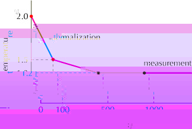

# Looper reference

ALPS Looper implements multi-cluster quantum Monte Carlo for generic spin systems in path-integral and stochastic series expansion (SSE) representations. It supports arbitrary spin size and lattices, XXZ two-spin interactions, single-ion anisotropy for spin greater than 1/2, and longitudinal and transverse magnetic fields. Freezing graphs support easy-axis anisotropy.

For a guided simulation, start with the [susceptibility](../mc-02-susceptibilities/) or [measurement](../mc-04-measurements/) tutorials. This reference describes the `loop` program supplied by the ALPS application build.

## Build and run

Follow the [ALPS build instructions](../../CONTRIBUTING.md#getting-started-with-the-code), with `ALPS_BUILD_APPLICATIONS=ON`, then build the `loop` target. The CMake presets select the build tools and dependencies described there.

For a plain build directory:

```sh
cmake --build build --target loop
```

Prepare simulation input with `parameter2xml` or `pyalps.writeInputFiles`, then run `loop` on the generated job file. The tutorial scripts demonstrate the complete workflow. Select `ALGORITHM="loop; path integral"` or `ALGORITHM="loop; sse"` in the input parameters. MPI support is opt-in when building ALPS.

## Input parameters

In addition to the ALPS scheduler parameters, Looper accepts:

| Name | Default Value | Description |
| --- | --- | --- |
| LATTICE_LIBRARY | Installed SDK XML resources | path to a file containing lattice descriptions |
| LATTICE | none | name of the lattice |
| MODEL_LIBRARY | Installed SDK XML resources | path to a file containing model descriptions |
| MODEL | none | name of the model |
| ALGORITHM | Specify explicitly | `"loop; path integral"` or `"loop; sse"` |
| T | none | temperature |
| T_START_# | undefined | [optional] see Temperature Annealing. |
| T_DURATION_# | undefined | [optional] see Temperature Annealing. |
| SWEEPS | `[65536:]` | Measurement sweep range; use an integer for a fixed number of sweeps. |
| THERMALIZATION | One eighth of the minimum `SWEEPS` (8192 by default) | Monte Carlo steps discarded for thermalization. |
| USE_SITE_INDICES_AS_TYPES | false | if true, all sites will have distinct site types, which are identical to site indices (starting from 0). |
| USE_BOND_INDICES_AS_TYPES | false | if true, all bonds will have distinct bond types, which are identical to bond indices (starting from 0). |
| MEASURE[Correlations] | false | if true, correlation function will be calculated |
| MEASURE[Green Function] | false | if true, Green's function will be calculated |
| INITIAL_SITE | undefined | initial site from which correlation function and Green's function are measured. If not defined, correlation between all possible site pairs will be calculated |
| MEASURE[Local Susceptibility] | false | if true, local susceptibility and local magnetization will be calculated |
| MEASURE[Structure Factor] | false | if true, structure factor for all possible k-values will be calculated |
| DISABLE_IMPROVED_ESTIMATOR | false | [optional] use normal (i.e. unimproved) estimator for measurements (will be set to true automatically in the presence of longitudinal magnetic field) |
| FORCE_SCATTER | 0 | Minimum probability for forward-scattering graphs; defaults to 0.1 for classically frustrated models to ensure ergodicity. |
| LOOPER_DEBUG[MODEL OUTPUT] | undefined | if defined, all the coupling constants will be printed out to standard output (cout) before calculation. If the value is cerr, the output will be made for standard error (cerr). |

Lattice and model definitions may require additional parameters, such as `L` or `W`. Installed programs locate the SDK's XML resources automatically; `ALPS_XML_PATH` can override the search location.

## Temperature annealing

Models with competing interactions may equilibrate slowly. Use `T_START_#` and `T_DURATION_#`, numbered from zero, to specify the starting temperature and duration of successive annealing blocks during thermalization.



The illustrated schedule uses:

```text
T_START_0 = 2.0;
T_DURATION_0 = 100;
T_START_1 = 1.5;
T_DURATION_1 = 400;
THERMALIZATION = 1000;
T = 1.2;
```

The sum of the block durations must not exceed `THERMALIZATION`.

## Measurements

The available observables and their conditions are:

| Name | Description |
| --- | --- |
| Energy | total energy |
| Energy Density | energy per spin |
| Energy^2 | square of total energy |
| Specific Heat | specific heat |
| Stiffness | stiffness constant |
| Magnetization | total uniform magnetization |
| Magnetization^2 | square of total uniform magnetization |
| Magnetization^4 | 4th power of total uniform magnetization |
| Binder Ratio of Magnetization | Binder ratio of uniform magnetization |
| Magnetization Density | uniform magnetization per spin |
| Magnetization Density^2 | square of uniform magnetization per spin |
| Magnetization Density^4 | 4th power of uniform magnetization per spin |
| Susceptibility | uniform susceptibility |
| Staggered Magnetization | total staggered magnetization [1] |
| Staggered Magnetization^2 | square of total staggered magnetization [1] |
| Staggered Magnetization^4 | 4th power of total staggered magnetization [1] |
| Staggered Magnetization Density | staggered magnetization per spin [1] |
| Staggered Magnetization Density^2 | square of staggered magnetization per spin [1] |
| Staggered Magnetization Density^4 | 4th power of staggered magnetization per spin [1] |
| Staggered Susceptibility | staggered susceptibility [1] |
| Generalized Magnetization | total generalized magnetization [2] |
| Generalized Magnetization^2 | square of total generalized magnetization [2] |
| Generalized Magnetization^4 | 4th power of total generalized magnetization [2] |
| Generalized Binder Ratio of Magnetization | Binder ratio of generalized magnetization [2] |
| Generalized Magnetization Density | generalized magnetization per spin [2] |
| Generalized Magnetization Density^2 | square of generalized magnetization per spin [2] |
| Generalized Magnetization Density^4 | 4th power of generalized magnetization per spin [2] |
| Generalized Susceptibility | generalized susceptibility [2] |
| Generalized Staggered Magnetization | total generalized staggered magnetization [1] [2] |
| Generalized Staggered Magnetization^2 | square of total generalized staggered magnetization [1] [2] |
| Generalized Staggered Magnetization^4 | 4th power of total generalized staggered magnetization [1] [2] |
| Generalized Staggered Magnetization Density | generalized staggered magnetization per spin [1] [2] |
| Generalized Staggered Magnetization Density^2 | square of generalized staggered magnetization per spin [1] [2] |
| Generalized Staggered Magnetization Density^4 | 4th power of generalized staggered magnetization per spin [1] [2] |
| Generalized Staggered Susceptibility | generalized staggered susceptibility [1] [2] |
| Spin Correlations | correlation functions [3] |
| Staggered Spin Correlations | staggered correlation functions [1] [3] |
| Generalized Spin Correlations | generalized correlation functions [2] [3] |
| Generalized Staggered Spin Correlations | generalized staggered correlation function [1] [2] [3] |
| Green's Function | Green's function [2] [4] |
| Structure Factor | static structure factor [5] |
| Local Magnetization | local magnetization [6] |
| Local Susceptibility | local susceptibility (i.e., response of uniform magnetization against local magnetic field or that of local magnetization against uniform magnetic field) [6] |
| Staggered Local Susceptibility | staggered local susceptibility (i.e., response of staggered magnetization against local magnetic field or that of local magnetization against staggered magnetic field) [1] [6] |
| Local Field Susceptibility | local-field susceptibility (i.e., response of local magnetization against local magnetic field) [6] |

1. Measured only for bipartite lattices.
2. Measured only with improved estimators.
3. Enable `MEASURE[Correlations]`.
4. Enable `MEASURE[Green Function]`.
5. Enable `MEASURE[Structure Factor]`.
6. Enable `MEASURE[Local Susceptibility]`.

The generalized susceptibility selects the ordering channel appropriate to the model. The staggered generalized susceptibility uses the staggered version of that channel:

| Model | Generalized Susceptibility | Generalized Staggered Susceptibility |
| --- | --- | --- |
| Ferromagnetic model with Ising anisotropy (in the Z axis) | uniform Z-Z susceptibility | staggered Z-Z susceptibility |
| Ferromagnetic model (Heisenberg point) | uniform Z-Z (or X-X) susceptibility | staggered Z-Z (or X-X) susceptibility |
| Ferromagnetic model with XY anisotropy (in the XY plane) | uniform X-X susceptibility | staggered X-X susceptibility |
| Antiferromagnetic model with XY anisotropy (in the XY plane) | staggered X-X susceptibility | uniform X-X susceptibility |
| Antiferromagnetic model (Heisenberg point) | staggered Z-Z (or X-X) susceptibility | uniform Z-Z (or X-X) susceptibility |
| Antiferromagnetic model with Ising anisotropy (in the Z axis) | staggered Z-Z susceptibility | uniform Z-Z susceptibility |

The same correspondence applies to uniform and staggered squared magnetization.

## References and attribution

- H. G. Evertz, “The loop algorithm,” Advances in Physics 52, 1 (2003).
- S. Todo and K. Kato, “Cluster Algorithms for General-S Quantum Spin Systems,” Physical Review Letters 87, 047203 (2001).
- S. Todo, “Parallel Quantum Monte Carlo Simulation of S=3 Antiferromagnetic Heisenberg Chain,” Computer Simulation Studies in Condensed-Matter Physics XV (Springer, 2003), pp. 89–94.
- See [Citing ALPS](../../CITATION.md) for the framework and method-specific citation guidance.

Adapted from the Looper manual, copyright 1997–2007 Synge Todo. The original acknowledges comments and suggestions from Matthias Troyer and Fabien Alet. Distributed under the [ALPS MIT license](../../LICENSE.txt).
